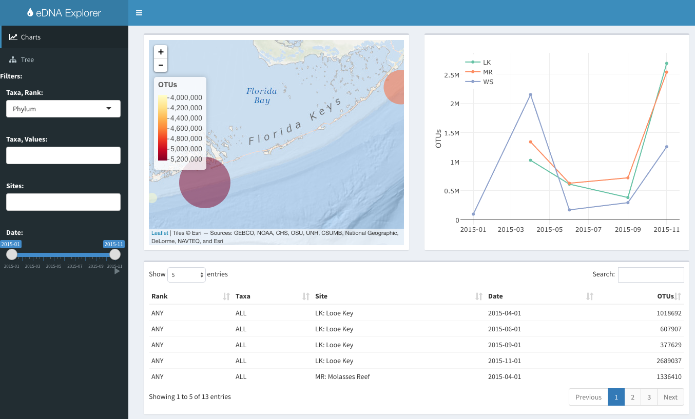

# edna-vis

visualization app for environmental DNA (eDNA), using R shiny

[ecoquants.shinyapps.io/edna-vis](https://ecoquants.shinyapps.io/edna-vis/)

For more details, see [marinebon.github.io/edna-vis](https://marinebon.github.io/edna-vis).
