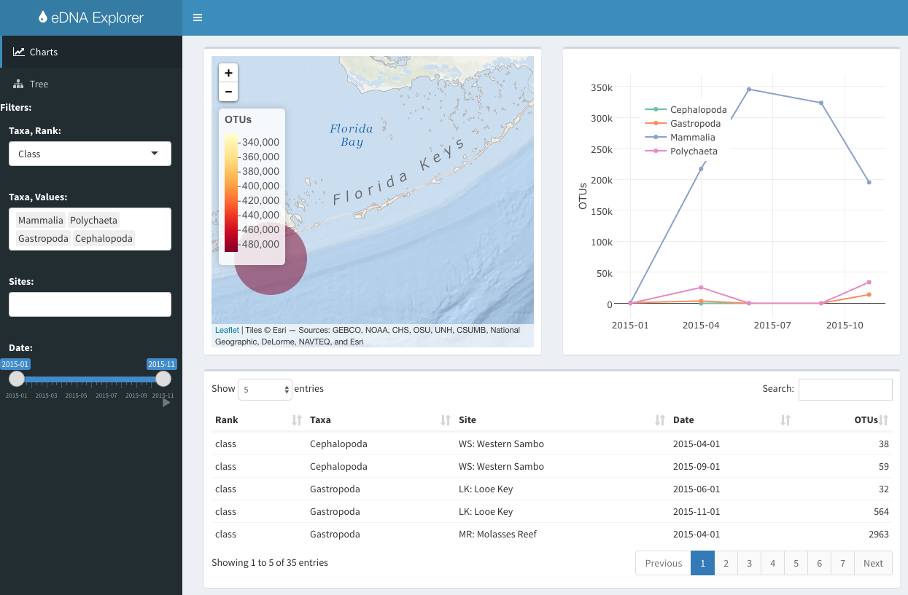
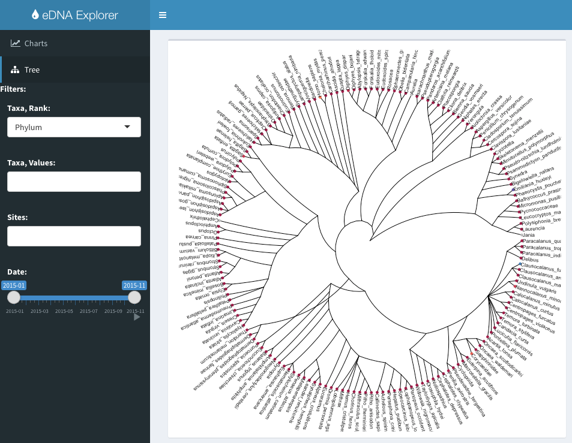

The **eDNA Explorer** is a visualization application for environmental DNA (eDNA), using [R shiny](http://shiny.rstudio.com/), based on counts of Operational Taxonomic Units (OTUs).

[ecoquants.shinyapps.io/edna-vis](https://ecoquants.shinyapps.io/edna-vis/)

## Status

As of `r format(Sys.time(), '%Y-%m-%d')`, this app is **alpha**, ie in active development, at only ``r length(readLines('../shiny/app.R'))`` lines of code (see source [app.R](https://github.com/marinebon/edna-vis/blob/master/shiny/app.R)).

## Accessing the App

### Website

[ecoquants.shinyapps.io/edna-vis](https://ecoquants.shinyapps.io/edna-vis/)

### Local

To run the app locally on your machine, you need to have the following installed:

- [**R**](https://cran.r-project.org/) statistical programming platform,
- [**R packages**](https://github.com/marinebon/edna-vis/blob/1229dca08d3471abeb940ae5ea8d1c9f553deb19/shiny/app.R#L5-L15) required by the app. To install an R package like "shiny", simply run `install.packages('shiny')`.

Then you can run the following single line to download and run locally on your machine:

```r
shiny::runGitHub('marinebon/edna-vis', subdir='shiny')
```

## Interface

### Filter

Applying filters in the sidebar, updates the Charts (and eventually Tree) accordingly:

- **Taxa**. Select rank, then available values to filter by taxa. Choosing one taxa allows you to see count of OTUs.
- **Sites**. Click on box button in upper left to limit range.
- **Date**. Drag slider to define date range to display.

You can slide the filter panel in and out of view with the sidebar toggle button .

### Tabs

#### Charts

The map, plot and table update based on the applied filters. If you choose more than one taxa, then the plot switches from summarizing by site to summarizing by taxa.



- **Map**. Summarizes across all sampling dates. Zoom (+/- or mouse scroll) or pan (click, hold and move) in map. Rollover to get site name. Click on site to get OTUs popup.
- **Plot**. Summarizes across sites by time. Click on legend labels to turn on/off individual lines.
- **Table**. Provides individual rows of data by taxa, site and date, sortable by any column, including OTUs.

#### Tree

The tree view is meant to show the count of OTUs by taxa, but does not yet have the filter applied.




## Notes

- [MBON conversations](https://docs.google.com/document/d/1jXZHGxmw6vzZy3BWf6a5w0tPjCBOlWKnb7gZjQTJRJc/edit?usp=sharing), particularly with Ben, Collin and Anni
- old: [eDNA Explorer with crosstalk](./crosstalk.html)

### Preparation

See [prep](./prep.html) on manipulations to go from original [OTU_table_taxa_all.txt](https://github.com/marinebon/edna-vis/blob/master/data/OTU_table_taxa_all.txt) to the [otu.csv](https://github.com/marinebon/edna-vis/blob/master/data/otu.csv) used in this visualization.

